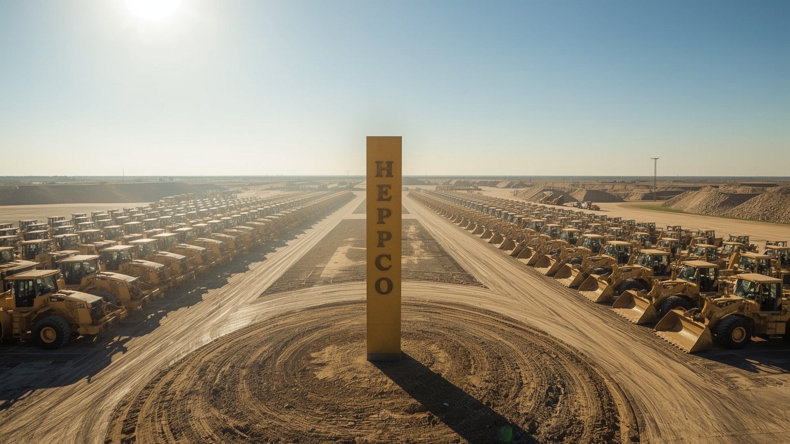

# HepcoServiceForm 🚜⚙️

A responsive React form designed for submitting overhaul requests for Hepco construction machinery. Built with React, Bootstrap, and Axios, it ensures smooth data entry and submission, offering an intuitive and user-friendly experience.

---

## 📌 Features
- ✅ Responsive and RTL support for Persian language  
- ✅ Select from various Hepco machinery models  
- ✅ Text inputs with floating labels for better UX  
- ✅ Data submission to a mock backend (json-server) via Axios  
- ✅ Clean and modern UI with React Bootstrap  

---

## 🛠️ Technologies Used
- React  
- React Bootstrap  
- Axios  
- JSON-Server (for mock backend)  

---

## 📥 Installation & Usage
1. Clone the repository  
2. Run `npm install` to install dependencies  
3. Start the mock backend server with `json-server --watch db.json --port 5000`  
4. Run the React app with `npm start`  
5. Fill out the form and submit to see data posted to the backend  

---

## 🎨 Design & Demo
🔗 [View Project Demo](https://github.com/arshiya-mh/testhepco)

---

## 🖼️ Screenshot

---

## 📜 License
This project is open-source and free to use.

---

🚀 Developed by Arshiya MH
